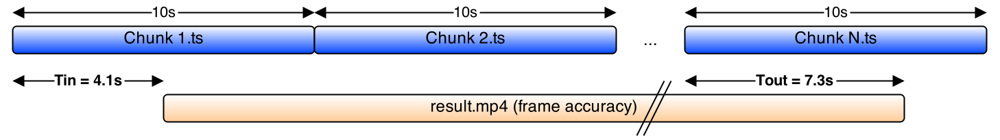

# HLS super fast frame accuracy trimming (JS)

#Usage
- Install: ffmpeg
- Ensure ffmpeg is in the PATH
- Use this syntax: `./trim_hls_frame_acc source_hls_dir dest_file tmp_dir trim_in trim_out`
    - Example: `./trim_hls_frame_acc /hls_test/ /out/test.mp4 /tmp 10.0 21.2`

#Description
- This is an evolution of this code: [Trim HLS stream with frame accuracy using [ffmpeg](https://ffmpeg.org/) and Bash script](https://jordicenzano.name/2014/08/07/trim-hls-stream-with-frame-accuracy-using-ffmpeg-and-bash-script-2/)
- This code gets a group if HLS chunks (.ts) and input and output timestamps and creates an output mp4 file frame accuracy trimmed, AV perfectly aligned, and thanks to the underlying algorithm in a very small amount of time.
- This algorithm can be useful to:
    - On the fly live streaming trimming
    - VOD frame accuracy trimming
    - Increase dramatically the speed of video editors (mostly cloud video editors)

#How it works
1. Split A/V form all input chunks, creating a .h264 and .acc files (just parsing operation)
2. For the first and the last chunks:
    - Get video frame position information from and calculate the video cutting point to preserve frame accuracy
    - Decode to YUV the first and last video chunks
    - Encode the trimmed YUV to the same codec as the original files
3. Concatenate all video segments to a final video .ts
4. For the first and the last audio chunks:
    - Get audio frame position information and calculate the audio cutting points based on video cutting points to preserve A/V alignment
    - Calculate AV delay necessary at the output file to preserve AV alignment
    - Trim the stream at packet level
5. Concatenate all audio segments to a final audio .aac
6. Mux final video and final audio file to MP4 preserving the previously calculated A/V delay

#Assumptions
- The video codec is H264 and the audio coded is aac
- All the chunks start with and I frame
- Only 1 video and 1 audio present in the input files
- The trim in timestamp and the trim out timestamp belongs to different chunks

#Future work
- Handle single segment trims (in point and out point in the same segment)
- Make the code usable for any input different than HLS
- Use the manifest as input parameter, not directory
    - Find the first and last segment based on the input and output timestamp (now we are assuming that we know what are the first and last segment)
- Modify the code to treat the input files at video GOP
    - Increase the processing speed (GOP vs Chunk)
    - No need that chunks start with I frame
    - Easier to handle other formats different than HLS
    