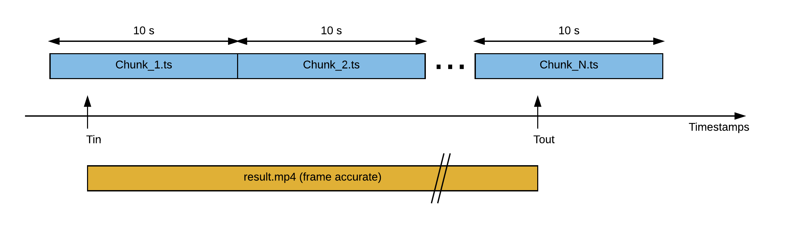

# HLS super fast frame accuracy trimming (JS)

#Usage
- Install: ffmpeg and nodejs
- Ensure ffmpeg is in the PATH
- Use this syntax: `./trim_hls_frame_acc source_hls dest_file tmp_dir trim_in trim_out`
    - Example1: `./trim_hls_frame_acc /hls_test/ /out/test.mp4 /tmp 10.0 21.2`
    - Example2: `./trim_hls_frame_acc /hls_test/test.m3u8 /out/test.mp4 /tmp 10.0 21.2`

#Description
- This code is an evolution of this code: [Trim HLS stream with frame accuracy using [ffmpeg](https://ffmpeg.org/) and Bash script](https://jordicenzano.name/2014/08/07/trim-hls-stream-with-frame-accuracy-using-ffmpeg-and-bash-script-2/)
- The purpose of this code gets a group if HLS chunks (.ts) and input and output timestamps and creates an output mp4 file frame accuracy trimmed, AV perfectly aligned, and thanks to the underlying algorithm in a very small amount of time.
- It can be useful to:
    - On the fly live streaming trimming (highlights)
    - VOD frame accuracy trimming
    - Increase dramatically the speed of video editors (mostly cloud video editors)

#How it works
1. Based on the in an out points analyze the input files an establish which are the first and last segments
1. Split A/V of the necessary chunks, creating a .ts (video only) and .acc files. It is just a parsing operation.
2. For the first and the last chunks:
    - Get video frame position information from and calculate the video cutting point to preserve frame accuracy
    - Decode to YUV
    - Encode the trimmed YUV to the same codec as the original files
3. Concatenate the video segments to a final video .ts
4. For the first and the last audio chunks:
    - Get audio frame position information and calculate the audio cutting points based on video cutting points to preserve A/V alignment
    - Calculate AV delay necessary at the output file to preserve AV alignment
    - Trim the stream at packet level
5. Concatenate the audio segments to a final audio .aac
6. Mux final video and final audio file to MP4 preserving the previously calculated A/V delay

#Assumptions
- The video codec is H264 and the audio coded is aac
- All the chunks start with and I frame
- Only 1 video and 1 audio present in the input files
- If you use hls manifest (.m3u8) as a source, only relative local paths are allowed
- The A/V delay in the original stream is reasonable (<2s)

#Future work
- Make the code usable for any input different than HLS
- Apply multi-threaded processing in some stages to speed up the process (reasonable goal is to increase the speed x2)
- Modify the code to process the input files at video GOP level (not chunk level)
    - Increase the processing speed (GOPs use to be smaller than chunks)
    - No need that chunks start with I frame
    - Easier to handle other formats different than HLS
    